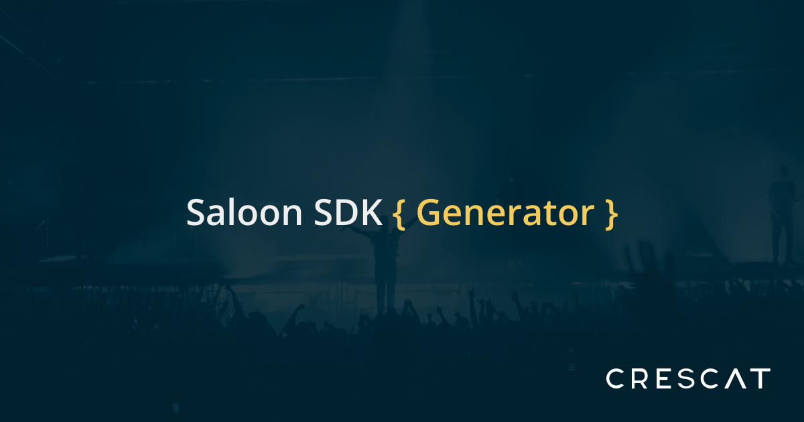

TODO:
- Move response schemas to the OpenApi responses section, then parse them from there
- Do the same with request schemas?
- Remove OpenApiReference checks from parser?


<p align="center"></p>

# Saloon SDK Generator - Simplified SDK Scaffolding 🚀

[](https://packagist.org/packages/highsidelabs/saloon-sdk-generator)
[](https://packagist.org/packages/highsidelabs/saloon-sdk-generator)

Introducing the Saloon SDK Generator – your tool for quickly creating the basic structure of PHP SDKs using the
powerful [Saloon](https://docs.saloon.dev/) package.

Please note: This tool helps you set up the foundation for your SDK, but it might not create a complete, ready-to-use
solution. 🛠️

Whether you're using Postman Collection JSON files (v2.1) or OpenAPI specifications, the Saloon SDK Generator simplifies
the process of generating PHP SDKs. It provides you with a starting point to build the initial framework for your API
interactions.

Keep in mind that the generated code might not be perfect for every situation. Think of it as a speedy way to scaffold
your SDK structure. While you might need to customize it for specific cases, the Saloon SDK Generator saves you time by
eliminating the need to create boilerplate code from scratch.

Your journey to crafting a tailored SDK starts here – with the Saloon SDK Generator. 🌟

## Installation

You can install this package using Composer:

```shell
composer global require crescat-io/saloon-sdk-generator
```

## Usage

To generate the PHP SDK from an API specification file, run the following command:

```shell
sdkgenerator generate:sdk API_SPEC_FILE.{json|yaml|yml}
     --type={postman|openapi}
    [--name=SDK_NAME]
    [--output=OUTPUT_PATH]
    [--namespace=Company\\Integration]
    [--force]
    [--dry]
    [--zip]
```

Replace the placeholders with the appropriate values:

- `API_SPEC_FILE`: Path to the API specification file (JSON or YAML format).
- `--type`: Specify the type of API specification (`postman` or `openapi`).
- `--name`: (Optional) Specify the name of the generated SDK (default: Unnamed).
- `--namespace`: (Optional) Specify the root namespace for the SDK (default: `App\\Sdk`).
- `--output`: (Optional) Specify the output path where the generated code will be created (default: ./Generated).
- `--force`: (Optional) Force overwriting existing files.
- `--dry`: (Optional) Perform a dry run. It will not save generated files, only show a list of them.
- `--zip`: (Optional) Use this flag to generate a zip archive containing all the generated files.

**Note:** Due to PHP using Backslashes `\`, when specifying the `--namespace`, you need to escape any backslashes like
so:

```shell
sdkgenerator generate:sdk ./tests/Samples/paddle.json
  --force
  --type=postman
  --name=Paddle
  --output ./paddle-sdk/src
  --namespace=Your\\Sdk\\Namespace # <-- Note the "\\"
```

## Using the Code Generator and Parser Programmatically

1. **Configure Your Generator:**

Configure the `CodeGenerator` with the desired settings:

```php
$generator = new CodeGenerator(
    namespace: "App\Sdk",
    baseFilesNamespace: "App\Sdk\Base",
    namespaceSuffixes: [
        'resource' => 'Resource',
        'request' => 'Request',
        'dto' => 'Dto',
    ],
    connectorName: 'MySDK', // Replace with your desired SDK name
    outputFolder: './Generated', // Replace with your desired output folder
    ignoredParams: [
        'query' => ['after', 'order_by', 'per_page'],
        'body' => [],
        'header' => [],
    ],
);
```

2. **Parse and Generate:**

Parse your API specification file and generate the SDK classes:

```php
$inputPath = 'path/to/api_spec_file.json'; // Replace with your API specification file path
$type = 'postman'; // Replace with your API specification type

$result = $generator->run(Factory::parse($type, $inputPath));
```

3. **Use Generated Results:**

You can access the generated classes and perform actions with them:

```php
// Generated Connector Class
echo "Generated Connector Class: " . Utils::formatNamespaceAndClass($result->connectorClass) . "\n";

// Generated Base Resource Class
echo "Generated Base Resource Class: " . Utils::formatNamespaceAndClass($result->resourceBaseClass) . "\n";

// Generated Resource Classes
foreach ($result->resourceClasses as $resourceClass) {
   echo "Generated Resource Class: " . Utils::formatNamespaceAndClass($resourceClass) . "\n";
}

// Generated Request Classes
foreach ($result->requestClasses as $requestClass) {
   echo "Generated Request Class: " . Utils::formatNamespaceAndClass($requestClass) . "\n";
}
```

---

## How It Works

The Saloon SDK Generator automates the creation of PHP SDKs by following these steps:

### 1. Parsing API Specifications

The parser reads and understands different API specification formats, including Postman Collection JSON (v2.1), OpenAPI
specifications, and custom formats. When executed, it:

- Takes an input file.
- Converts the contents into an internal format called `ApiSpecification`.
- This format provides a comprehensive view of the API, which the SDK generator uses.

### 2. Auto-generating SDK Components

This component automatically generates essential SDK components based on parsed specifications:

- Request classes
- Resource classes
- Data Transfer Objects (DTOs)
- Connectors
- Foundational resource class

### 3. Configurable Generators

The Saloon SDK Generator is modular, allowing you to replace default generators with custom ones to tailor the SDK
generation to your needs. The following generators can be customized:

- `BaseResourceGenerator`
- `BaseRequestGenerator`
- `BaseResponseGenerator`
- `BaseDtoGenerator`
- `ConnectorGenerator`
- `DtoGenerator`
- `RequestGenerator`
- `ResourceGenerator`
- `SupportingFilesGenerator`

## Core Data Structures

These foundational structures form the basis of the generated SDK output:

### 1. ApiSpecification

- Represents the entire API specification.
- Contains metadata like name, description, base URL, and endpoints catalog.

### 2. Config

- Central repository for SDK generator configurations.
- Defines namespaces, component suffixes, and other parameters.
- Customizable for specific requirements.

### 3. Endpoint

- Describes individual API endpoints.
- Includes method types, path segments, and related parameters.

### 4. GeneratedCode

- Captures the complete generated SDK code.
- Encompasses PHP files for request classes, resource classes, DTOs, connectors, and foundational resource class.

### 5. Parameter

- Describes parameters associated with API endpoints.
- Includes attributes like type, name, and nullability.

## Building a Custom Parser

If you're working with an API specification format that isn't natively supported by the Saloon SDK Generator, you can
build a custom parser to integrate it. Here's how you can do it:

1. **Create Your Custom Parser:**

Start by creating a custom parser class that implements the `Crescat\SaloonSdkGenerator\Contracts\Parser` interface.

There are two ways to initialize a Parser. The first one is through the constructor, which will receive the filePath
specified when running `sdkgenerator generate:sdk {FILE_PATH}`.

Example:

```php
<?php

namespace YourNamespace\CustomParser;

use Crescat\SaloonSdkGenerator\Contracts\Parser;
use Crescat\SaloonSdkGenerator\Data\Generator\Endpoint;
use Crescat\SaloonSdkGenerator\Data\Generator\ApiSpecification;
use Crescat\SaloonSdkGenerator\Data\Generator\Parameter;

class CustomParser implements Parser
{
    public function __construct(protected $filePath) {}

    public function parse(): ApiSpecification
    {
        // TODO: Implement
        parseTheContents($this->filepath)
        // Implement a parser that will return an ApiSpecification object:

        return new ApiSpecification(
            name: 'Custom API',
            description: 'A custom API specification',
            baseUrl: 'https://api.example.com',
            endpoints: [
                new Endpoint(
                    name: 'GetUserInfo',
                    method: 'GET',
                    pathSegments: ['users', '{user_id}'],
                    description: 'Get user information by ID',
                    queryParameters: [
                        new Parameter('string', false, 'user_id', 'User ID'),
                    ],
                ), new Endpoint(
                    name: 'CreateUser',
                    method: 'POST',
                    pathSegments: ['users'],
                    description: 'Create a new user',
                    bodyParameters: [
                        new Parameter('string', false, 'username', 'Username'),
                        new Parameter('string', false, 'email', 'Email'),
                    ],

                )
            ],
        );
    }
}
```

Or, if you need to pre-process the file, either over the network or run third party code that is not suitable for the
constructor, you may add a `build` method, which will be called instead.

Example from the OpenApiParser:

```php
public static function build($content): static
{
    // Call file readers depending on the filetype provided (supports JSON and YAML)
    return new static(
        Str::endsWith($content, '.json')
            ? Reader::readFromJsonFile(fileName: realpath($content), resolveReferences: ReferenceContext::RESOLVE_MODE_ALL)
            : Reader::readFromYamlFile(fileName: realpath($content), resolveReferences: ReferenceContext::RESOLVE_MODE_ALL)
    );
}
```

2. **Register Your Custom Parser:**

To make your custom parser available in the SDK Generator, you need to register it using the `Factory`
class's `registerParser` method.

```php
use Crescat\SaloonSdkGenerator\Factory;
use YourNamespace\CustomParser;
// Replace with the actual namespace of your custom parser

// Register your custom parser
Factory::registerParser('custom', CustomParser::class);
```

3. **Use Your Custom Parser:**

Once registered, you can use your custom parser just like any other built-in parser. Specify `'custom'` as the `--type`
option when generating the SDK, and the SDK Generator will use your custom parser to process the API specification.

```shell
sdkgenerator generate:sdk API_SPEC_FILE.xxx --type=custom
```

Replace `API_SPEC_FILE.xxx` with the path to your custom API specification file.

Now your custom parser is seamlessly integrated into the Saloon SDK Generator, allowing you to generate SDKs from API
specifications in your custom format.

## Swapping Out Default Code Generators

The Saloon SDK Generator is built with flexibility in mind. If you need to customize the generation process for any
component of the SDK, you can easily swap out any of the default generators with your own custom implementation.

### Implementing a Custom Generator

To create a custom generator:

1. Create a new class that implements the `Crescat\SaloonSdkGenerator\Contracts\Generator` interface.

   This interface requires two methods:
    - A constructor that accepts a `Config` object.
    - A `generate` method that returns either a single `PhpFile` or an array of `PhpFile` objects.

Example:

```php
namespace YourNamespace;

use Crescat\SaloonSdkGenerator\Contracts\Generator;
use Crescat\SaloonSdkGenerator\Data\Generator\ApiSpecification;
use Crescat\SaloonSdkGenerator\Data\Generator\Config;
use Nette\PhpGenerator\PhpFile;

class CustomRequestGenerator implements Generator
{
    public function __construct(Config $config)
    {
        // Initialize your generator with the configuration
    }

    public function generate(ApiSpecification $specification): PhpFile|array
    {
        // Your custom generation logic here
    }
}
```

### Using Your Custom Generator

Once you've created your custom generator, you can use it by passing an instance of it when creating
the `CodeGenerator`:

```php
$customRequestGenerator = new CustomRequestGenerator($config);

$codeGenerator = new CodeGenerator(
    config: $config,
    requestGenerator: $customRequestGenerator
    // ... you can pass other custom generators as needed
);

$result = $codeGenerator->run($specification);
```

By providing your custom generator as an argument to the `CodeGenerator`, it will be used in place of the default one.
This allows for extensive customization of the SDK generation process to suit your specific needs.

---

## Tested with Real API Specifications Samples

To showcase the capabilities of the Saloon SDK Generator and to ensure its compatibility with real-world API
specifications, we have tested it with the following API specs.

- [Paddle](https://developer.paddle.com/api-reference/overview) (*Not publicly available*)
- [Stripe](https://www.postman.com/stripedev/workspace/stripe-developers/collection/665823-fb030f33-dcb4-4475-a812-968d7d449fa4) (
  *Postman*)
- [Tableau](https://www.postman.com/salesforce-developers/workspace/salesforce-developers/collection/12721794-7d783742-165f-4d10-8c4c-5719fb60fba2) (
  *Postman*)
- [OpenAI](https://www.postman.com/devrel/workspace/openai/api/7e57d35c-a167-487d-bbf2-51b11576a0d8) (*Postman*)
- [Fiken](https://api.fiken.no/api/v2/docs/swagger.yaml) (*OpenApi*)
- [GoCardless](https://bankaccountdata.gocardless.com/api/swagger.json) (*OpenApi*)
- [Tripletex](https://tripletex.no/v2/swagger.json) (*OpenApi*)

### Generate SDKs

To generate SDKs from the provided API specs, you can run the following composer scripts:

```shell
composer generate:paddle
composer generate:stripe
composer generate:tableau
composer generate:openai
composer generate:fiken
composer generate:gocardless
composer generate:tripletex
```

### Generate Zip Archives

If you prefer, (and partially to show that it can do it), you can also generate zip archives of the SDKs:

```shell
composer generate:zip:paddle
composer generate:zip:stripe
composer generate:zip:tableau
composer generate:zip:openai
composer generate:zip:fiken
composer generate:zip:gocardless
composer generate:zip:tripletex
```

Feel free to experiment with these commands to see how the Saloon SDK Generator transforms API specifications into PHP
SDKs. While these tests provide valuable insights, keep in mind that compatibility may vary depending on the complexity
of your specific API specification.

## Reporting Incompatibilities

We understand that compatibility issues may arise when using the Saloon SDK Generator with various API specifications.
While we welcome reports about these incompatibilities, it's important to note that this tool was initially developed
for our internal use and has been open-sourced to share with the community.

If you encounter issues or incompatibilities while generating SDKs from your API specifications, we encourage you to
report them on our [GitHub Issue Tracker](https://github.com/crescat-io/saloon-sdk-generator/issues). Your feedback is
valuable and can help us improve the tool over time.

However, please understand that due to the nature of the project and our own priorities, we may not always be able to
implement immediate fixes for reported issues.

We appreciate your understanding and your interest in using the Saloon SDK Generator. Your contributions, feedback, and
reports will contribute to the ongoing development and improvement of this tool for the broader community.

## Links and References

- [Postman Collection Format](https://learning.postman.com/collection-format/getting-started/structure-of-a-collection/)
- [Postman Collection Format Schema](https://blog.postman.com/introducing-postman-collection-format-schema/)
- [Importing and Exporting Data in Postman](https://learning.postman.com/docs/getting-started/importing-and-exporting/exporting-data/)
- [OpenAPI Specification](https://swagger.io/specification/)

## Building binary

To build the binary for distribution on Packagist, run the following command:

```shell
php ./builds/sdkgenerator app:build sdkgenerator --build-version=1.0
```

Or use the composer script:

```shell
composer build
```

## TODOs

- Create configuration (sdkgenerator --config=sdkgenerator.php/json) file that allows you to override behaviour like:
    - what body format to use by default or fallback on
    - how to handle Pagination
    - if JSON bodies with null values should be removed
    - failure handling  (AlwaysThrowOnErrors, custom exception classes,
      or [custom method](https://docs.saloon.dev/the-basics/handling-failures#customising-when-saloon-thinks-a-request-has-failed))
    - etc... (feel free to [add suggestions](https://github.com/crescat-io/saloon-sdk-generator/issues))
- Configurable Conflict Resolver
    - (overwrite (same as --force),
    - new (parse code and only add code that is "new", aka new params, new methods),
    - prompt user for each conflict (like git in interactive mode)
    - etc...
- When no body can be parsed for POST requests, it should warn the user and add a TODO in the generated code.
- Support older swagger API specification
- Generate tests for all endpoints using Request mocking ([see](https://docs.saloon.dev/testing/recording-requests))
- Inject "path" variable in the resource constructor via the connector for clean chaining
    - example: `$sdk->resource(userId: 1)->deleteUser();`

## Contributing

Contributions to this package are welcome! If you find any issues or want to suggest improvements, please submit a pull
request or open an issue in the [Issue Tracker](https://github.com/crescat-io/saloon-sdk-generator/issues).

## Credits

This package is built on the shoulders of giants, special thanks to the following people for their open source work that
helps us all build better software! ❤️

- [Nette PHP Generator](https://github.com/nette/php-generator)
- [Nuno Maduro for Laravel Zero](https://github.com/laravel-zero/laravel-zero)
- [Sam Carré for Saloon](https://github.com/Sammyjo20)

## Built by Crescat

[Crescat.io](https://crescat.io/products/) is a collaborative software designed for venues, festivals, and event
professionals.

With a comprehensive suite of features such as day sheets, checklists, reporting, and crew member booking, Crescat
simplifies event management. Professionals in the live event industry trust Crescat to streamline their workflows,
reducing the need for multiple tools and outdated spreadsheets.

## Troubleshooting:

### Fixing `command not found` errors

You most likely don't have the composer `vendor/bin` folder in your `$PATH`

```shell
# Default config file paths
# Zsh:   ~/.zshrc
# Bash:  ~/.bashrc or ~/.bash_profile
# Fish:  ~/.config/fish/config.fish

# Replace 'YOUR_USERNAME' with your actual username
# Example: '/Users/john/.composer/vendor/bin'

# Zsh
echo 'export PATH="/Users/YOUR_USERNAME/.composer/vendor/bin:$PATH"' >> ~/.zshrc
source ~/.zshrc

# Bash
echo 'export PATH="/Users/YOUR_USERNAME/.composer/vendor/bin:$PATH"' >> ~/.bashrc
source ~/.bashrc

# Fish
echo 'set -gx PATH "/Users/YOUR_USERNAME/.composer/vendor/bin" $PATH' >> ~/.config/fish/config.fish
source ~/.config/fish/config.fish
```

## License

The MIT License (MIT). Please see [License File](LICENSE.md) for more information.
